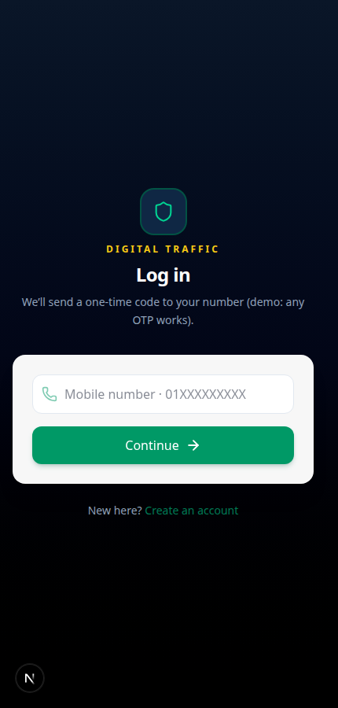
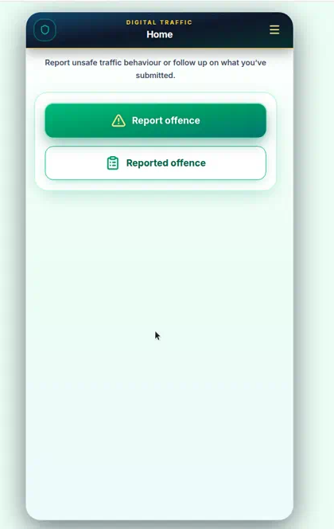
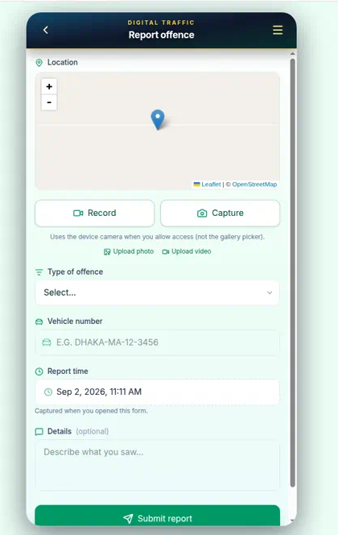

# Digital Traffic

A mobile-first web app for reporting traffic offences in Bangladesh. Register with a phone number, pin the location on a map, attach photo or video evidence, and track reports from your device.

**Live demo:** [https://traffic-hazel.vercel.app](https://traffic-hazel.vercel.app)

<p align="center">
  
  
  
</p>

## Overview

Digital Traffic is a citizen reporting prototype. You sign in with a Bangladesh mobile number (OTP is simulated in this demo), then submit an offence with map location, vehicle number, offence type, optional details, and camera evidence. Reports are stored in the browser so you can follow them under **Reported offence**.

## Tech stack

| Layer | Technology |
| --- | --- |
| Framework | [Next.js](https://nextjs.org/) 16 (App Router) |
| UI | [React](https://react.dev/) 19 |
| Language | TypeScript |
| Styling | Tailwind CSS 4 |
| Maps | Leaflet + react-leaflet + OpenStreetMap |
| Icons | lucide-react |
| Persistence | Browser `localStorage` (demo, no backend yet) |

## Features

- Phone login and registration (Bangladesh numbers, demo OTP accepts any code)
- Home actions: **Report offence** and **Reported offence**
- Interactive map with geolocation (defaults to Dhaka if permission is denied)
- Offence types: no number plate, no parking, wrong route, signal violation, over speeding, wrong lane, other
- Photo/video capture from the device camera, plus file upload
- Vehicle number, timestamp, and optional details
- Report list with **In progress** / **Done** tabs
- Profile with user id, mobile, and credit points
- FAQ

## Dependencies

From `package.json`:

**Runtime**

| Package | Role |
| --- | --- |
| `next` | App framework and routing |
| `react` / `react-dom` | UI |
| `leaflet` / `react-leaflet` | Map on the report form |
| `lucide-react` | Icons |

**Development**

| Package | Role |
| --- | --- |
| `typescript` | Type checking |
| `tailwindcss` / `@tailwindcss/postcss` | Styling |
| `eslint` / `eslint-config-next` | Linting |
| `@types/node`, `@types/react`, `@types/react-dom`, `@types/leaflet` | Type definitions |

Requires **Node.js 20.9+**.

## Run locally

```bash
git clone https://github.com/SalmanAAbir/traffic.git
cd traffic
npm install
npm run dev
```

Open http://localhost:3000

### Demo login

1. Enter a valid Bangladesh mobile number, for example `01712345678`
2. On the OTP screen, enter any digits (the demo does not send a real SMS)
3. New accounts continue to a short profile form (name and email)

### Other scripts

```bash
npm run build   # production build
npm start       # serve the production build
npm run lint    # ESLint
```

Data stays in your browser (`localStorage`). Clearing site data removes accounts and reports.

## Links

| | |
| --- | --- |
| Live demo | https://traffic-hazel.vercel.app |
| Repository | https://github.com/SalmanAAbir/traffic |
| Next.js | https://nextjs.org/docs |
| Leaflet | https://leafletjs.com/ |
| Tailwind CSS | https://tailwindcss.com/ |
